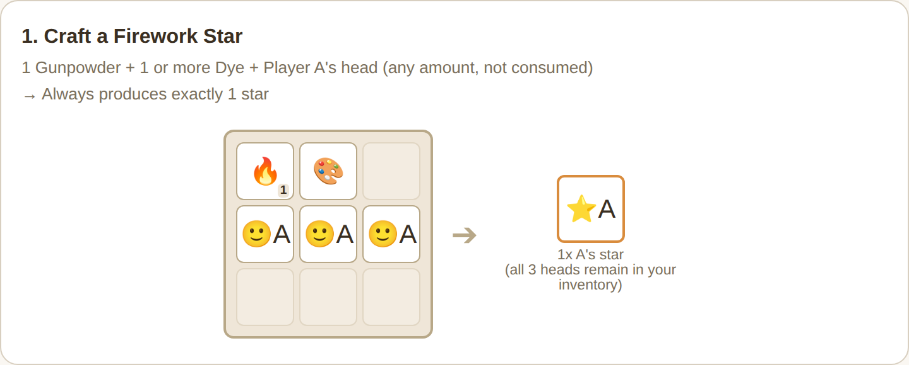
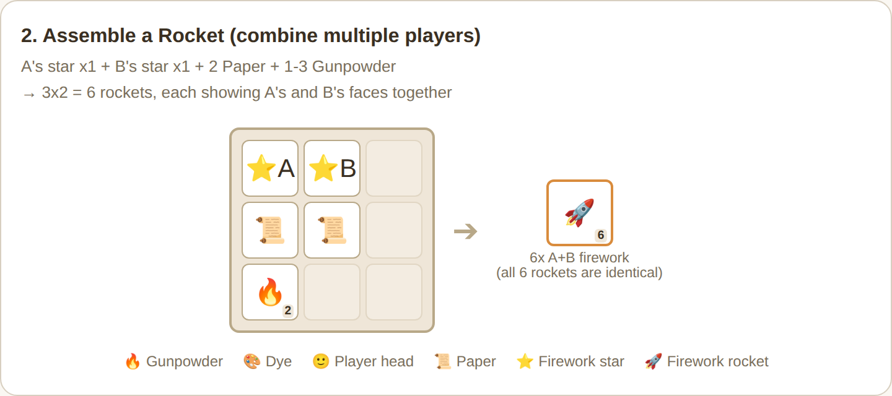

# HeadFirework Crafting Recipes

This covers only the recipes and mechanics that **become available by installing the HeadFirework MOD/plugin** — not vanilla firework colors or shapes. Both the MOD and Paper versions behave identically (the MOD version's star crafting was aligned with the Paper version's behavior).

## 1. Craft a Firework Star (attach a face)

Ingredients: 1 Gunpowder + 1 or more Dye + one or more heads of the target player (same player only)

- You can use any number of heads from the same player, but they are **never consumed** (they remain in your inventory after crafting)
- No matter how many heads you use, you always get **exactly 1 star**
- Using more heads does **not** produce more stars

| Heads used | Heads consumed | Stars produced |
|---|---|---|
| 1 | 0 (kept) | 1 |
| 3 | 0 (kept) | 1 |
| 9 (grid full) | 0 (kept) | 1 |

If you want another star, just craft again with the same head(s) — they're reusable.

## 2. Assemble a Rocket (turn the face into a firework)

Ingredients: 1 or more stars + Paper (same count as stars) + 1-3 Gunpowder

- You **can mix stars from different players** in one craft, combining multiple people's faces into a single rocket (up to 5 people)
- The number of rockets produced is **3 × total number of stars used**
- **Important:** all rockets produced in a single craft are identical — they are not split up per person

| Stars used | Paper | Gunpowder | Rockets produced | Faces shown on explosion |
|---|---|---|---|---|
| 1x A's star | 1 | 1-3 | 3 | All 3 show "A only" |
| 1x A's star + 1x B's star | 2 | 1-3 | 6 | All 6 show "A and B together" |
| 2x A's star + 1x B's star | 3 | 1-3 | 9 | All 9 show "A and B together" (A's face appears twice) |

If you want both "A alone" rockets and "A and B together" rockets, you need to craft them separately (once with only A's star, and again with A's and B's stars combined).

The amount of gunpowder (1-3) doesn't affect the rocket count — it only changes flight duration/height.

### What 5 people at once looks like

Combining the maximum of 5 players' stars into one rocket displays all 5 faces side by side when it explodes.

## 3. Face direction

The direction a face looks when it explodes follows **the setting of the player the head belonged to** — not the player who launched the rocket (falls back to the server default if that player hasn't set a personal preference). When multiple faces are shown at once, each one follows its own owner's setting. See "Setting your own face direction" in the user guide for details.

---

*The diagrams above are original illustrations meant to convey the idea, not actual in-game screenshots.*
