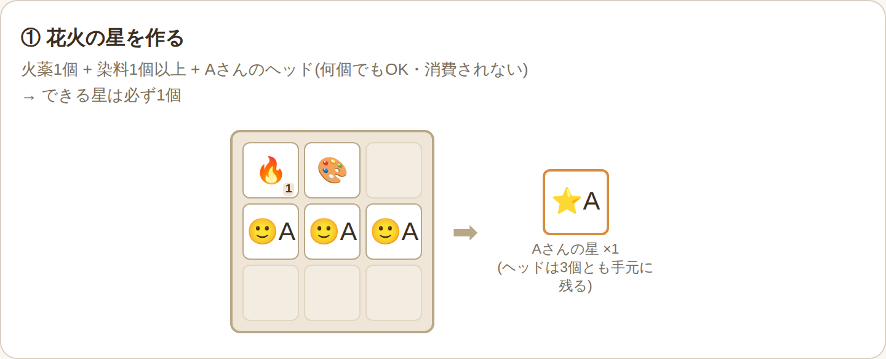
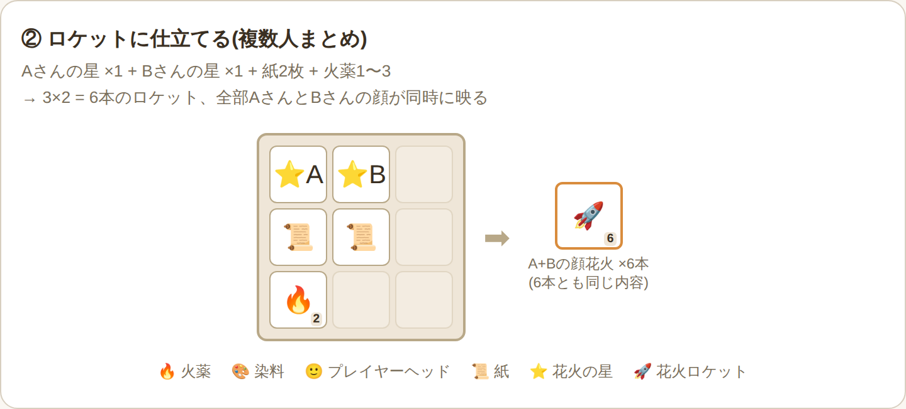
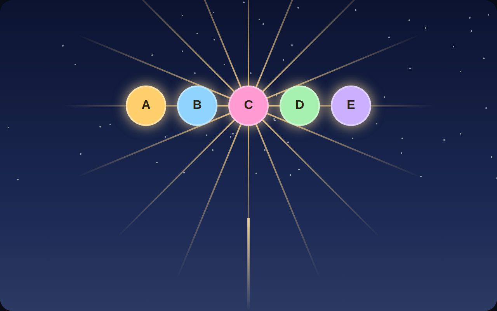

# HeadFirework クラフトレシピ集

染料の色や形状(花火本来の要素)ではなく、**HeadFirework MOD/プラグインを導入することで新しくできるようになったレシピ**だけをまとめたものです。MOD版・Paper版どちらも同じ仕様です(MOD版は頭の個数による星の増加を廃止し、Paper版と統一済み)。

## 1. 花火の星を作る(顔を紐づける)

材料: 火薬1個 + 染料1個以上 + 対象プレイヤーのヘッド1個以上(同じプレイヤーのみ)

- ヘッドは同じプレイヤーのものであれば何個入れてもよいが、**一切消費されない**(クラフト後もそのまま手元に残る)
- ヘッドの個数に関わらず、できる星は**必ず1個**
- 「ヘッドをたくさん入れれば星もたくさんできる」わけではない

| 入れるヘッドの個数 | 消費されるヘッド | できる星の数 |
|---|---|---|
| 1個 | 0個(残る) | 1個 |
| 3個 | 0個(残る) | 1個 |
| 9個(枠いっぱい) | 0個(残る) | 1個 |

星をもう1個欲しい場合は、同じヘッドを使ってもう一度クラフトすればよい(ヘッドは使い回せる)。

## 2. ロケットに仕立てる(顔を花火にする)

材料: 星1個以上 + 紙(星と同じ枚数) + 火薬1〜3個

- 星は**違うプレイヤー同士のものを混ぜてOK**(1本のロケットに複数人の顔をまとめられる。最大5人分まで)
- できるロケットの本数は「**3 × 使った星の合計数**」
- **重要:** 1回のクラフトでできたロケットは、その回でまとめた分が"全部同じ内容"になる。個別の相手ごとに分かれて出てくるわけではない

| 使う星 | 紙 | 火薬 | できるロケット | 爆発した時に映る顔 |
|---|---|---|---|---|
| Aさんの星 ×1 | 1枚 | 1〜3 | 3本 | 3本とも「Aさんの顔だけ」 |
| Aさんの星 ×1 + Bさんの星 ×1 | 2枚 | 1〜3 | 6本 | 6本とも「AさんとBさんの顔が同時に」表示 |
| Aさんの星 ×2 + Bさんの星 ×1 | 3枚 | 1〜3 | 9本 | 9本とも「AさんとBさんの顔が同時に」表示(Aさんの顔は2つ並ぶ) |

「Aさんだけの花火」と「AさんとBさん一緒の花火」を両方使いたい場合は、クラフトを分ける必要があります(1回目: Aさんの星だけでロケットを作る/2回目: Aさん+Bさんの星でロケットを作る)。

火薬の数(1〜3)は本数には影響せず、飛翔時間(打ち上がる高さ)だけを変えます。

### 最大5人同時表示のイメージ

最大の5人分の星をまとめてロケットを作ると、打ち上げ・爆発時にこのように5人分の顔が横一列に並んで同時表示されます。

## 3. 顔の向き

爆発した時の顔の向きは、打ち上げた人ではなく「**星の元になったヘッドの持ち主本人**」の設定に従います(個人設定をしていない場合はサーバーの既定値)。複数人の顔を同時表示する場合も、それぞれ自分の設定通りの向きで表示されます。詳しくは使用説明書の「自分の花火の顔の向きを設定する」の項目を参照してください。

---

※図解はイメージを分かりやすくするためのオリジナルの模式図で、実際のゲーム画面とは異なります。
